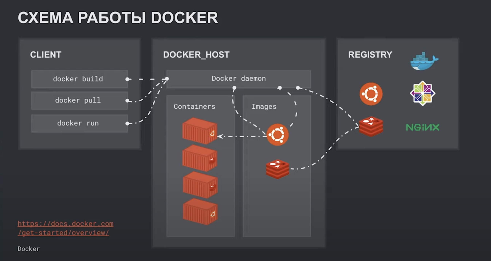
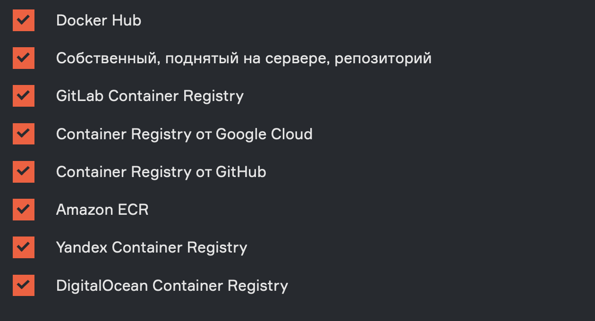
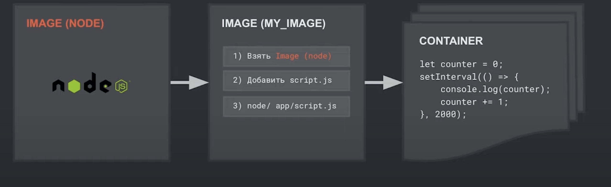

# Carpov courses docker
### Docker 
Docker - это контейнеризатор приложений. Платформа для
удобной разработки, доставки, разработки и 
эксплуатации приложений

Докер лучше ВМ с точки зрения скорости, объема памяти,
времени внесения изменений.

Плюсы Docker:
* Изолированность от других программ
* Стандартизация
* Воспроизводимость 
* Откат
* Масштабирование

Сущности Docker:
* Демон (docker daemon)
    - Программа, которая работает в фоновом режиме и управляет всеми объектами докера
  

* Образ (docker image)
    - Инструкция того, каким должен быть контейнер
    - Строится слоями
    - Некоторые слои кэшируются (и их можно переиспользовать)
  

* Репозиторий / Реестр (docker registry)
    - Сервер, на котором хранятся готовые образы
  

* Контейнер (docker container)
    - Изолированная среда запуска приложений 
    - Поднимаются на основе образов

    

### Images
Образы могут храниться: 

    

### Docker File 
Файл с инструкциями, на основании которых 
собирается контейнер

    

#### Инструкции
- FROM: Задает базовый образ, на основе которого собирается новый

- COPY: Копирует файл/папку с файловой системы хоста в файловую систему контейнера

- RUN: позволяет запустить произвольный скрипт 

- CMD (ENTRYPOINT): Задает программу, которая запустится при поднятии контейнера

### Связывание файлов и папок

- bind mount 
- volume 

Отличие:
- с volume можно работать через docker 
- на host volume лежат в специальном месте
- volume не зависит от ОС хоста 
- volume более безопасны
- volume позволяет связывать только папки 

Вывод: volume - это история про связывание папок, bind mount - это больше про файлы 

### Best Practice

- .dockerignore
- Уменьшать кол-во слоев

