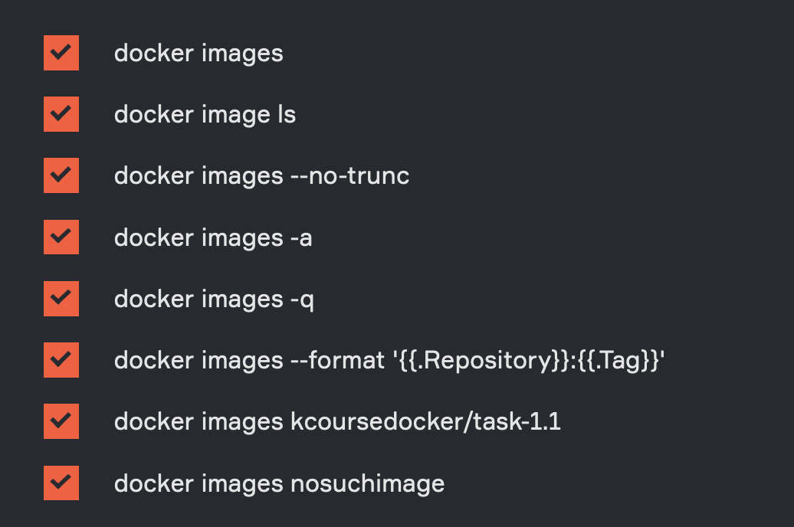

# Good commands
##### [Docker hub](https://hub.docker.com)

* Первоначальная подготовка
```
docker run --rm --platform=linux/amd64 kcoursedocker/task-1.1
```
+ 
## Основные команды

+ Создать образ на основе контейнер
```
docker commit <container>
```
### Images
По умолчанию скачивается последняя версия образа. Есть 
**alpine version**, которая построена по принципу: "Оставить самое нужное" 
+ Скачать образ
```
docker pull <image>
```
+ Скачать определенной образ
```
docker pull <image>:version
```
+ Посмотреть список образов
```
docker images
```
+ Удалить образы
```
docker rmi <image>
```

+ Дополнительные команды
<p align="center" width="100%">
    
</p>


### Container
#### Run
+ поднять контейнер на основе образа
```
docker run <image>
```
##### Option
```
      docker run --name <имя> <образ> — при поднятии присвоить имя контейнеру

      docker run --rm <образ> — удалять контейнер после завершения его работы

      docker run -it <образ> — позволяет «войти» в контейнер во время его создания 

      docker run -d <образ> — поднять контейнер в фоновом режиме
```
+ Поднять оставновленный контейнер
```
    docker start <container>
```
#### PS
+ Посмотреть все **запущенные контейнеры**
```
    docker ps
```
+ Посмотреть все **контейнеры**
```
    docker ps -a
```
+ Посмотреть только id контейнеров
```
    docker ps -q
```

#### Delete
+ Удалить остановленный контейнер 

```
    docker rm <container>
```

#### Execute
+ Войти и изменить код в контейнере
```
    docker exec -it <container> bash 
  
```
### Bash
+ Передать значение в другую команду

```
    $(command)
  
```

+ `.` - current directory 

## Работа с Dockerfile 

+ Запустить сборку
```
    docker build -t <name_image:tag> <path>
    
```
